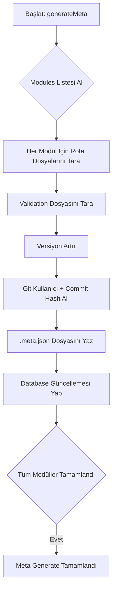

---

# 🚀 `generateMeta` Sistemi - MetaHub Backend

## 📚 Hakkında
`generateMeta`, **MetaHub Backend** projesinde bulunan tüm **modüller** için otomatik şekilde **meta dosyası** (`.meta.json`) oluşturan ve yöneten bir sistemdir.  
Ayrıca:
- 🔄 Modüllerdeki rotaları (`routes`)
- 🛡 Validation şemalarını (`express-validator`)
- 🧠 Git kullanıcı adı ve son commit hash bilgisini
- 📈 Versiyon bilgisini (`1.0.1`, `1.0.2`, vs.)
otomatik olarak toplayıp kayıt altına alır.

---

## 📦 Dosya Yapısı

```bash
src/
└── scripts/
    └── generateMeta/
        ├── index.ts                   # generateMeta ana export
        ├── generateMeta.config.ts      # ignore edilmesi gereken modüller
        ├── generate.ts                 # ana generate işlemleri
        └── utils/
            ├── constants.ts            # Regex gibi sabitler
            ├── envHelpers.ts           # Ortam değişkenlerini okuma
            ├── extractRoutes.ts        # Rotaları analiz eden yardımcı
            ├── fileSystemHelpers.ts    # Dosya işlemleri yardımcıları
            ├── gitHelpers.ts           # Git kullanıcı ve commit bilgisi
            ├── updateMetaVersion.ts    # Versiyon + tarih + kullanıcı güncelleme
            ├── validationSchemaReader.ts # Validation şemalarını çıkarır
            └── versionHelpers.ts       # Versiyon artırıcı yardımcı
```

---

## ⚙️ Nasıl Çalışır?

1. `bun run generate:meta` veya `npm run generate:meta` komutu çalıştırılır.
2. Sistem `/modules` klasöründeki tüm modülleri tarar.
3. Her modül için:
   - `.routes.ts` dosyasındaki endpointler çıkarılır.
   - Eğer varsa `.validation.ts` dosyasından body şeması çıkarılır.
   - Git kullanıcı adı (`git config user.name`) okunur.
   - Son commit hash (`git rev-parse HEAD`) bulunur.
   - Modülün `.meta.json` dosyası güncellenir veya oluşturulur.
   - DB'de `ModuleMetaModel` ve `ModuleSetting` kayıtları güncellenir.
4. İşlem sonunda:
   - ✅ Her modül için kaç rota bulunduğu raporlanır.
   - ✅ Hangi modüllerin `ignored` olduğu gösterilir.
   - ✅ Swagger API otomatik olarak güncellenmiş olur.

---

## 🛠 Kullanım

**Meta Generate Başlatmak:**
```bash
bun run generate:meta
# veya
npm run generate:meta
```

**Watch Mod (Geliştirme İçin):**
> (Opsiyonel olarak `watch:meta` scripti de eklenebilir.)

```bash
bun run watch:meta
```

---

## 🔥 generateMeta Akış



---

## 📄 Meta Dosyası Yapısı

Örnek bir `.meta.json` içeriği:

```json
{
  "version": "1.0.4",
  "updatedBy": {
    "username": "orhan",
    "commitHash": "ab12cd34ef56"
  },
  "lastUpdatedAt": "2025-04-26T20:00:00.000Z",
  "history": [
    {
      "version": "1.0.4",
      "by": "orhan",
      "commitHash": "ab12cd34ef56",
      "date": "2025-04-26T20:00:00.000Z",
      "note": "Meta auto-generated"
    }
  ],
  "routes": [
    {
      "method": "GET",
      "path": "/",
      "auth": true,
      "summary": "Get all users",
      "body": {
        "type": "object",
        "properties": {
          "email": { "type": "string" }
        }
      }
    }
  ]
}
```

---

## 🚫 Ignore Sistemi

`generateMeta.config.ts` dosyasındaki `ignoreModules` listesine eklenen modüller **generate** sürecinde atlanır.

Örnek:

```ts
export const metaConfig = {
  ignoreModules: [
    "offer",
    "testmodule"
  ],
};
```

Bu modüller Swagger'a ve Meta'ya dahil edilmez.

---

## 🛡 Validation Desteği

- Eğer bir modül `.validation.ts` dosyası içeriyorsa,  
  `express-validator` şemaları otomatik okunur.
- Body parametreleri Swagger şeması içine entegre edilir.

Eksik validation dosyalarında:
```bash
⚠️ Validation import failed for module: articles
```
gibi basit bir uyarı çıkar.

---

## 🧹 Eski Meta Dosyalarını Temizleme

`generateMeta` çalıştığında, artık var olmayan modüllere ait `.meta.json` dosyaları:
- Silinir.
- DB'den de ilgili kayıtları (`ModuleMetaModel`, `ModuleSetting`) temizler.

Böylece çöp dosya birikmesi engellenir.

---

## 📈 Versiyonlama Sistemi

- Her `generateMeta` çalıştırıldığında modül versiyonu **patch olarak artırılır** (`1.0.5` -> `1.0.6` gibi).
- `updatedBy` alanına:
  - `Git user.name`
  - `Son commit hash`
otomatik eklenir.
- Geçmiş değişiklikler `history` dizisine kaydedilir.

---

# ✅ Özetle

| Özellik         | Durum  |
|-----------------|--------|
| Rota analizi    | ✅     |
| Validation analizi | ✅  |
| Git bilgisi     | ✅     |
| Commit hash     | ✅     |
| Versiyon artışı | ✅     |
| Orphan temizleme| ✅     |
| Swagger güncelleme | ✅  |
| Çoklu profil desteği | ✅ |

---

# 📌 Notlar
- `.env` dosyasında mutlaka `ENABLED_MODULES` doğru listelenmelidir.
- Validation eksikse sadece uyarı verir, işlemi durdurmaz.
- Git bilgisi için local `git` config ayarları doğru olmalıdır.

---
